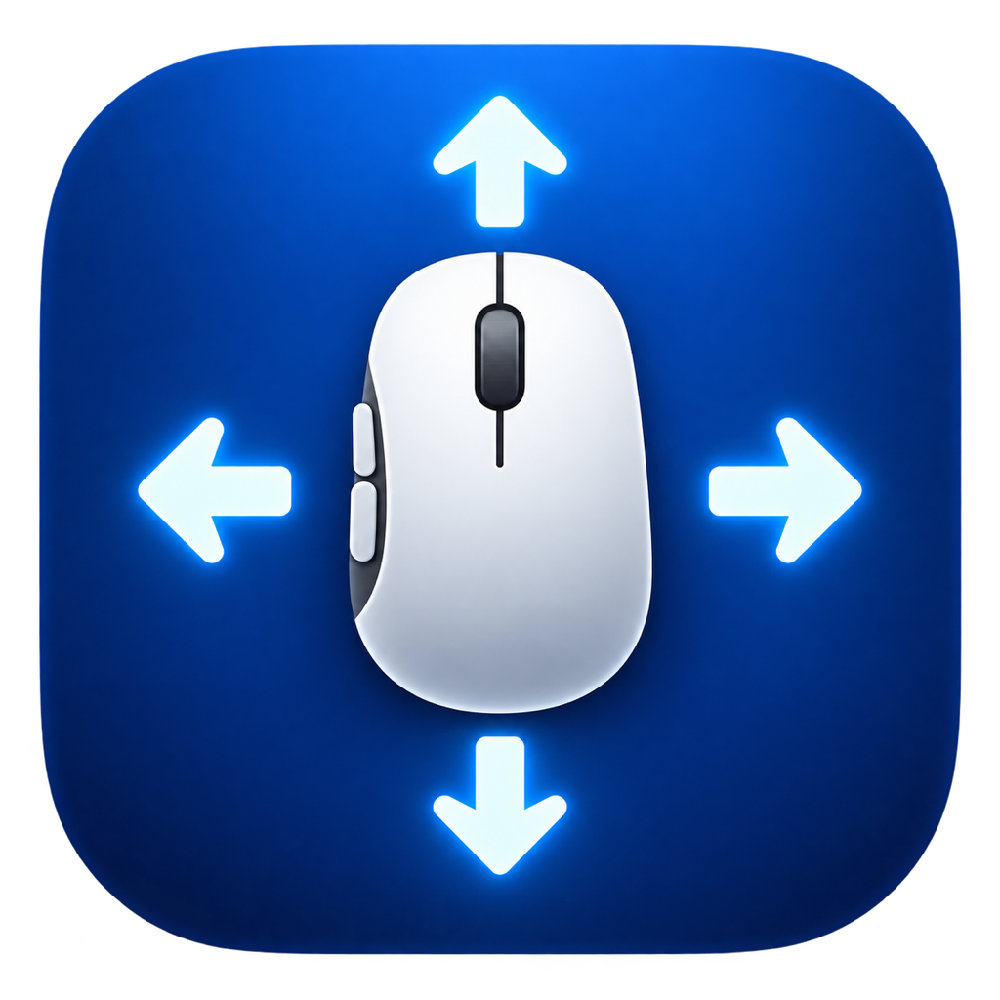

# MacMouseGesture

使用普通鼠标侧键，在 macOS 上获得类似触控板的连续系统手势。

按住任一启用的侧键并拖动：

| 方向 | 操作 |
|---|---|
| ← / → | 切换桌面空间 |
| ↑ | 调度中心 |
| ↓ | 应用 Exposé |

**0.2.0-beta.1 · Beta Preview，尚未公开发布。**

## 功能

- 两颗侧键共用四方向手势，支持停顿、继续、反向和松手结束。
- 当前 Build 31 开发版沿用已确认的 Prototype v2：主表为“鼠标输入 / 操作方式 / 执行动作”，动作可直接选择，添加与编辑共用录制和冲突提示流程。
- 短按、长按、按住滚轮映射独立配置；四方向连续拖动合并为“触控板式手势”一行，在详情中分别启停方向、调整明确标注作用范围的全局参数。
- 设置保存在本机，可选登录时启动；关闭窗口后继续在菜单栏运行。
- 动作菜单新增“锁定屏幕 / 打开访达 / 新建文件夹”。打开访达显示个人主目录窗口；新建文件夹仅作用于前台访达的当前目录。
- 鼠标断连后支持有限次数自动恢复；连接稳定后仍不可用时，可在帮助页重新尝试。

开发版使用[Mapping System v1](docs/mapping-system-v1-2026-10-04.md)及既有兼容 adapter；Build 30 只接入配置界面，存储格式、输入监听和连续手势核心保持原样。动作真实可用范围以[验收记录](docs/short-click-action-audit-2026-10-01.md)为准。需要带额外侧键的鼠标。当前 UI 与配置行为见 [Prototype v2 接入记录](docs/mapping-ui-v2-integration-2026-10-05.md)。

## 下载与安装

公开后从 [GitHub Releases](https://github.com/double-u-zw/MacMouseGesture/releases) 获取安装包和校验和。当前尚无经批准的公开安装包。

1. 打开 DMG，将 MacMouseGesture 拖到“应用程序”。
2. 启动安装后的 App，按设置向导开启“辅助功能”权限。
3. 测试鼠标侧键，然后开始使用。

当前本地候选使用本地签名，尚无 Developer ID 分发签名或 Apple 公证；最终分发路线仍待确认。若系统阻止打开，请先核实来源并参考[安装说明](docs/INSTALL.md)，不要关闭系统安全保护。

## 权限

MacMouseGesture 需要“辅助功能”权限，将侧键拖动转换为系统手势。“输入监控”仅用于额外的鼠标兼容性诊断，不是基本手势的必需权限。更换应用身份或签名后可能需要重新授权。详见[权限与排错](docs/TROUBLESHOOTING.md)。

## 支持范围与 Beta 限制

目前面向 **macOS 27 / Apple Silicon**，其他系统、芯片及鼠标环境尚未充分验证。详见[兼容性记录](docs/compatibility-matrix.md)。

连续系统手势依赖 macOS **private / undocumented API**，系统更新可能导致功能失效；不承诺长期兼容性。应用 Exposé 在部分外接显示器全屏场景下可能有轻微收尾延迟。目前没有自动更新。

## 隐私

无需账户，无云同步、遥测或自动上传。设置保存在本机，诊断日志保留在内存；只有主动复制或导出时才保存诊断信息，分享前请检查内容。[隐私说明](PRIVACY.md) · [卸载说明](docs/UNINSTALL.md)。

## 反馈

请通过 [GitHub Issues](https://github.com/double-u-zw/MacMouseGesture/issues) 提交问题，注明系统版本、鼠标型号、连接方式及复现步骤。不要提供设备序列号或未经检查的诊断文件。安全问题请参阅 [SECURITY.md](SECURITY.md)。

## License / Acknowledgements

MacMouseGesture 自有源代码采用 [MIT License](LICENSE)。第三方组件、接口和历史研究材料的说明见[第三方致谢](THIRD_PARTY_NOTICES.md)，这些说明不改变各自适用的条款。

早期系统手势研究参考过 Mac Mouse Fix，旧实现的历史归因保留。当前 Bridge 已按项目功能规格替换，工程来源审计未发现当前实现中的 MMF 代码派生部分；这不是法律保证。[第三方致谢](THIRD_PARTY_NOTICES.md) · [来源记录](docs/system-gesture-provenance.md)。
## General Mouse Input Recorder v1（开发版）

Build 26 新增“按下鼠标按钮…”录制入口。中键、侧键和其他额外按钮可直接录入，支持 ⌘ / ⌥ / ⌃ / ⇧ 与鼠标短按组合；左、右键保持保护。录制期间暂停普通服务，录制用的按下和松开不会执行已有映射；取消或 Escape 不保存配置。

CG raw 2...31 对应中键至用户鼠标按钮 32，侧键 4 / 5 身份保持不变。精确修饰键组合优先，没有组合项时回退普通短按，不做模糊包含。拖动仍沿用现有连续手势，修饰键拖动暂不支持。

新增 43 项，总计 317 自动化 PASS；本轮中键、侧键 4、侧键 5、⌘+侧键 4 真机验收通过，其他额外按键因无硬件跳过。旧 ⇧⌘4 键盘录制限制、Finder 返回问题继续冻结。包含修饰键的配置使用文档 v2，旧 Build 25 会安全停止解析该短按文档。完整实现与开发包说明见 [本轮报告](docs/general-mouse-input-recorder-v1-2026-10-04.md)。未覆盖稳定 Build 17，未发布。

## Long Press Trigger v1（开发版）

Build 27 支持按钮短按和长按独立配置，包含修饰键组合。长按默认 500ms 执行一次；提前松开立即短按，拖动先识别则取消长按，长按先触发则本次不再进入拖动。录制器、连续手势核心与动作执行器保持不变。

新增 69 项，总计 386 自动化 PASS；本轮指定的 5 项核心真机验收全部 PASS。包含长按的配置使用文档 v3，旧开发版安全拒绝读取，不会把长按误触为短按。独立开发包位于 build/long-press-v1/build27，稳定 Build 17 保留，未发布。详见 [长按实现与验收记录](docs/long-press-trigger-v1-2026-10-04.md)。

Build 28 新增“按住按钮并向上/下滚动”，支持修饰键快照、多按钮归属和重复 logical step。Wheel 与 Short/Long/Drag 共用 press claim；有映射才参与消费，首次 Wheel 成功后锁定触发家族。统一处理自然滚动方向、离散/连续累计和限速，包含 wheel 的配置使用 v4。新增 88 项，总计 474 自动化 PASS；本轮指定真机 8/8 PASS（当前标签页切换配置；连续设备阈值未做额外校准），连续阈值暂未真机校准。独立开发包位于 build/button-wheel-v1/build28，稳定 Build 17 保留，未发布。详见 [Button + Wheel 实现与验收记录](docs/button-wheel-trigger-v1-2026-10-04.md)。

## UI Redesign v1（Build 29 开发版）

本方案未获 UI 认可，现保留为历史开发包；当前界面沿用下方已确认的 Prototype v2 结构。

设置统一为“鼠标映射 / 手势 / 通用”。映射按物理按钮动态分组，修饰键显示在行内；短按、长按、滚轮与四方向拖动共用编辑 Sheet，逐条启停与删除。全局方向和手感位于手势页，服务及登录启动位于通用页。旧侧键整体开关和重复拖动配置入口已移除。

Drag 继续使用原连续手势链，通过兼容 adapter 表示固定方向动作；原配置在首次编辑拖动行前不进行批量迁移。恢复默认参数不覆盖映射。新增 54 项回归，528/528 自动化 PASS（原测试中的旧 UI 语义预期同步更新）。独立包位于 build/ui-redesign-v1/build29，Build 28/27/稳定 Build 17 保留，未发布。详见 [完整实现与检查报告](docs/ui-redesign-v1-2026-10-04.md) 和 [实施前控件清单](docs/ui-redesign-v1-legacy-inventory-2026-10-04.md)。

## Prototype v2 接入（Build 30 开发版）

经确认后，三列表格、添加与编辑弹窗、重复映射提示和手势详情已接入真实配置。复用原鼠标输入录制器与快捷键录制器；弹窗中的修改在保存时应用，取消不写入。主表普通动作选择器直接应用选择，停用行变灰并显示“已停用”。设置为次级入口，运行状态、权限检查和安装位置各有一个入口，帮助与关于位于设置内。

四方向合并仅是展示分组，打开界面不迁移、不删除方向记录。全局参数不覆盖方向启停。显式停用整个手势组后，本次会话可恢复先前方向状态；重启后从详情选择要启用的方向，避免恢复原本停用的方向。删除需确认，支持本次会话撤销。

独立开发包位于 `build/mapping-ui-v2/build30`，已打开供体验；原型和全部旧构建保留，未安装覆盖、未发布。配置回归与桥接检查通过，实际窗口已检查；这些检查不代替用户的 UI 验收或鼠标手感验收。详见 [接入记录](docs/mapping-ui-v2-integration-2026-10-05.md)。

真实 UI 接入完成后，已确认正式 App、Package 和测试均不引用独立模拟 prototype。提交整理时移除了两版模拟源码及专用构建脚本，正式运行代码保持原样；既有本地原型包和旧开发包继续保留在被忽略的 `build/` 下。

## 锁屏与访达动作（Build 31 开发版）

主表及添加、编辑弹窗均可选择“锁定屏幕”“打开访达”“新建文件夹”。锁屏使用既有执行器；打开访达通过系统文件浏览器 API 打开个人主目录；新建文件夹仅在访达前台时发送原生新建文件夹命令，在当前目录创建并进入命名，其他应用中不执行。

配置字段和文档版本不变，仅增加两个动作值。原映射、全局参数、输入监听和手势核心保持原样。隔离回归与实际菜单检查通过，真实锁屏和鼠标触发效果待验收。独立开发包位于 `build/desktop-actions-v1/build31`，Build 30 及旧构建保留，未发布。详见 [实现记录](docs/desktop-actions-v1-2026-10-05.md)。
